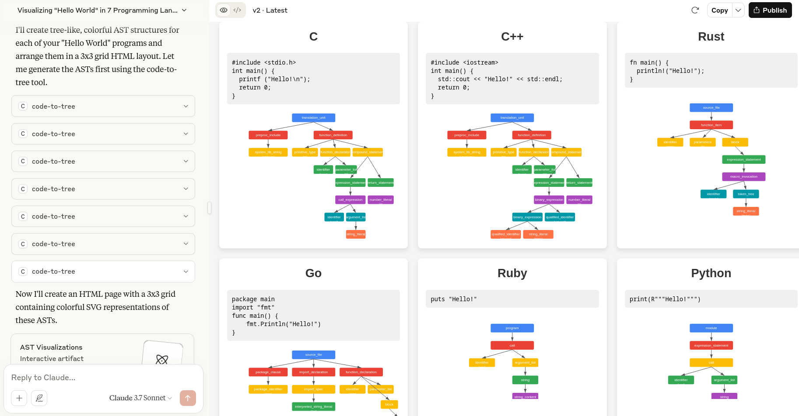
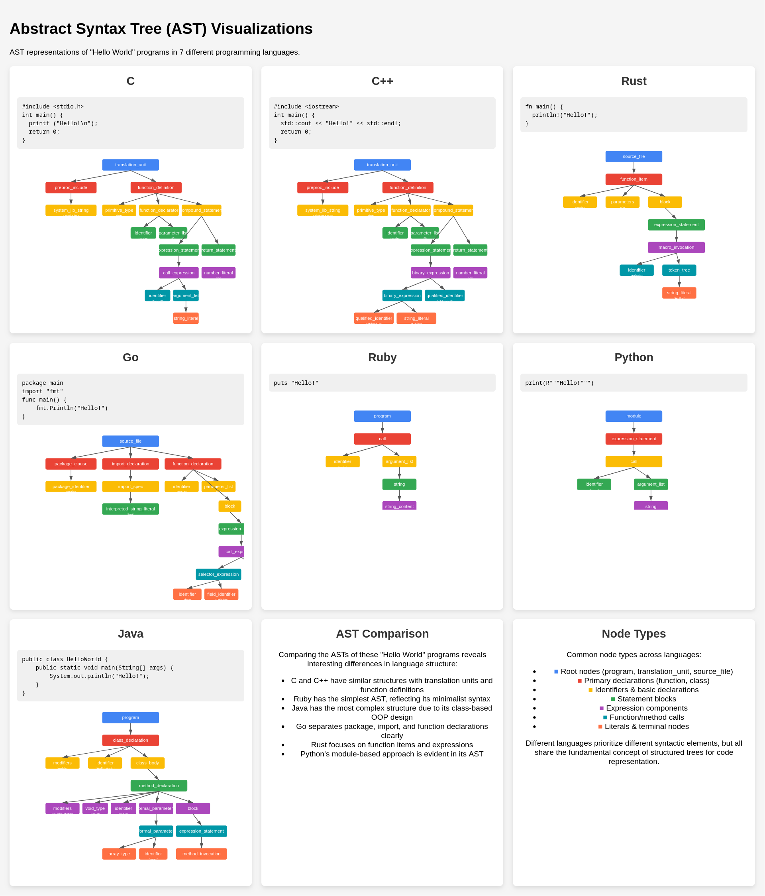

# Table of Contents

-   [MCP server: code-to-tree](#org5e4bb26)
    -   [Using code-to-tree](#orgcea1f70)
    -   [Configure MCP Clients](#org447c369)
    -   [Building (Windows)](#org4c1b53d)
    -   [Building (macOS)](#org410b1bb)
-   [More yet to come&#x2026;](#org01cb714)

# MCP server: code-to-tree

The `code-to-tree` server's goals are:

1.  Give LLMs the capability of **accurately** converting source code into
    AST(Abstract Syntax Tree), regardless of language.
2.  One **standalone** binary should be everything the MCP client needs.

These goals imply:

1.  The underlying syntax parser should be versatile enough to perform
    requested tasks. Here we choose **tree-sitter**, and languages are:
    C, C++, Rust, Ruby, Go, Java, Python.
2.  The MCP server should be able to carry every capability within
    itself, meaning minimum extra software dependencies on the end
    user's machine. Here we choose **mcpc**.

## Using code-to-tree

Before everthing, you need to have the code-to-tree executable on your
machine (`code-to-tree.exe` for Windows, `code-to-tree` for macOS),
you can download from Github release page or build yourself. Once
downloaded, you configure your MCP clients to install it, check the section
*"Configure MCP Clients"* for more details.

**Screenshots:**

The above screenshots are obtained by asking the question specified
in `q.md`. 

(**IMPORTANT NOTE**: LLMs have no responsibility of generating the identical
result for the same question,  you will likely get a completely different
style or content. The screenshots or questions provided here are just for the reference)

## Configure MCP Clients

Here we use Claude as the example.

### Windows

In your Claude configuration
(`C:\Users\YOUR_NAME\AppData\Roaming\Claude\claude_desktop_config.json`),
specify the location of `code-to-tree.exe`:

    {
        "mcpServers": {
    	    "code-to-tree": { "command": "C:\\path\\to\\code-to-tree.exe" }
        }
    }

### macOS

In your Claude configuration,
(`~/Library/Application Support/Claude/claude_desktop_config.json`)
specify the location of `code-to-tree`

    {
        "mcpServers": {
    	    "code-to-tree": { "command": "/path/to/code-to-tree" }
        }
    }

## Building (Windows)

### 1. Prepare environment

1.  download & install MSYS2.
2.  open application "MSYS2 MINGW64"
3.  run `pacman -S make gcc git`

### 2. Prepare tree-sitter libraries

Here we need to compile and install tree-sitter and all related grammars.

Clone them:

    git clone https://github.com/tree-sitter/tree-sitter
    
    git clone https://github.com/tree-sitter/tree-sitter-c
    
    git clone https://github.com/tree-sitter/tree-sitter-cpp
    
    git clone https://github.com/tree-sitter/tree-sitter-rust
    
    git clone https://github.com/tree-sitter/tree-sitter-ruby
    
    git clone https://github.com/tree-sitter/tree-sitter-go
    
    git clone https://github.com/tree-sitter/tree-sitter-java

Compile and install them:

    cd tree-sitter && OS=1 make install
    
    cd tree-sitter-c && OS=1 make install
    
    cd tree-sitter-cpp && OS=1 make install
    
    cd tree-sitter-rust && OS=1 make install
    
    cd tree-sitter-ruby && OS=1 make install
    
    cd tree-sitter-go && OS=1 make install
    
    cd tree-sitter-java && OS=1 make install

### 3. Build code-to-tree

Install mcpc:

    git clone https://github.com/micl2e2/mcpc
    cd mcpc && make install

Compile code-to-tree:

    cd mcpc/example/code-to-tree
    
    CFLAGS="-I/usr/local/include -L/usr/local/lib" make
    
    # Check the binary
    file code-to-tree.exe
    
    # Remember the binary's location
    pwd
    # Assume the output is: /c/path/to/code-to-tree.exe

## Building (macOS)

### 1. Prepare environment

1.  Xcode Command Line Tools

### 2. Prepare tree-sitter libraries

Here we need to compile and install tree-sitter and all related grammars.

Clone them:

    git clone https://github.com/tree-sitter/tree-sitter
    
    git clone https://github.com/tree-sitter/tree-sitter-c
    
    git clone https://github.com/tree-sitter/tree-sitter-cpp
    
    git clone https://github.com/tree-sitter/tree-sitter-rust
    
    git clone https://github.com/tree-sitter/tree-sitter-ruby
    
    git clone https://github.com/tree-sitter/tree-sitter-go
    
    git clone https://github.com/tree-sitter/tree-sitter-java

Compile and install them:

    cd tree-sitter && make install
    
    cd tree-sitter-c && make install
    
    cd tree-sitter-cpp && make install
    
    cd tree-sitter-rust && make install
    
    cd tree-sitter-ruby && make install
    
    cd tree-sitter-go && make install
    
    cd tree-sitter-java && make install

### 3. Build code-to-tree

Install mcpc:

    git clone https://github.com/micl2e2/mcpc
    cd mcpc && make install

Compile code-to-tree:

    cd mcpc/example/code-to-tree
    
    make
    
    # Check the binary
    file ./code-to-tree
    
    # Remember the binary's location
    pwd
    # Assume the output is: /path/to/code-to-tree

# More yet to come&#x2026;

